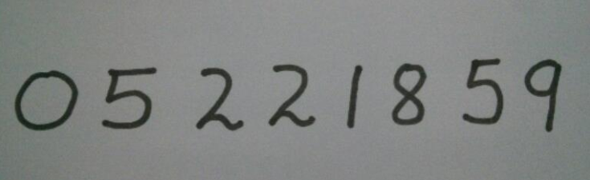
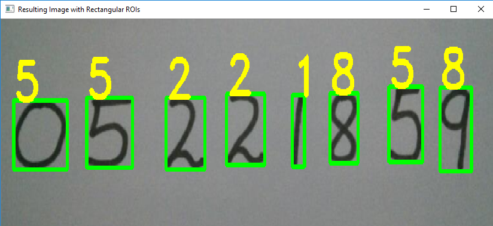

# Handwritten-Digit-Recognition-with-Support-Vector-Machine(SVM)
•	Calculated the HOG features for each sample in the MNIST dataset; trained a multi-class linear SVM with the HOG features of each sample along with the corresponding label and saved the classifier; processed the input image and calculated the HOG features to predict by the saved classifier 

